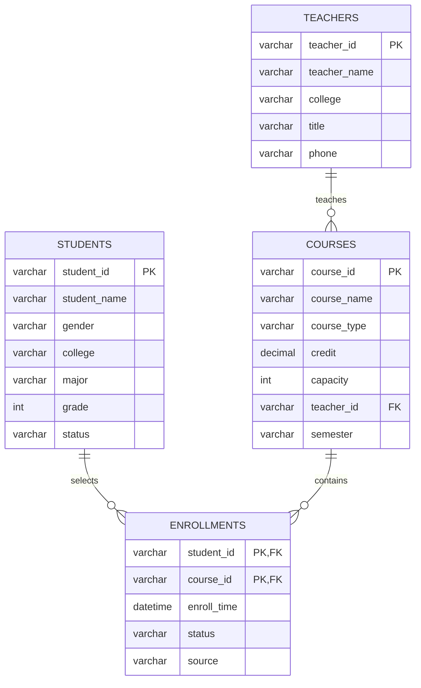
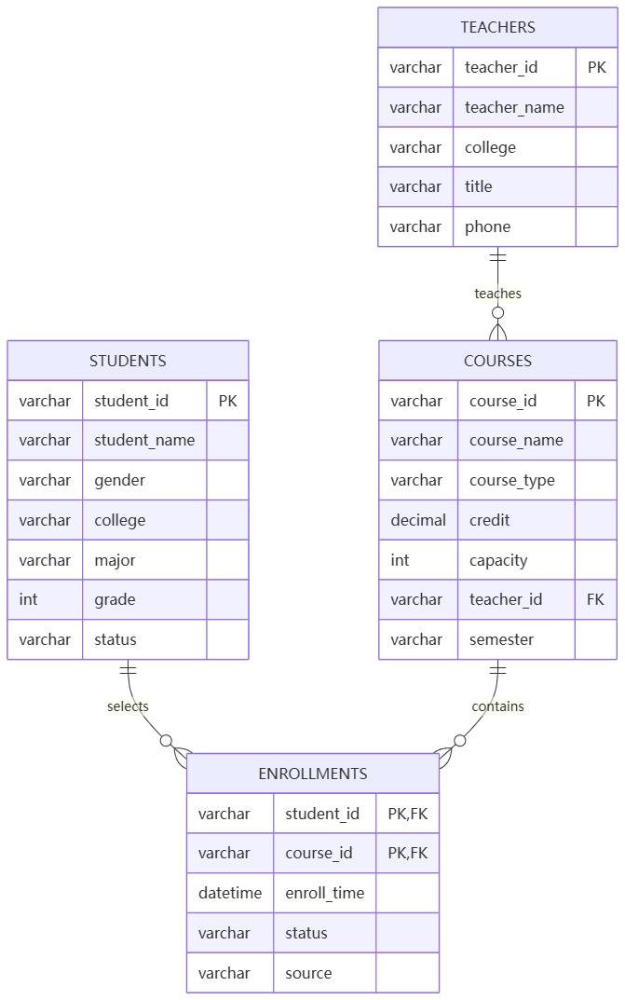

# 高校选课管理系统任务完成说明

## 1. 学生选课基础处理工具

已在 Spring Boot 项目中实现选课记录处理能力：

- 实体类：`src/main/java/com/example/basedemo/model/EnrollRecord.java`
- 第一题基础处理工具：`src/main/java/com/example/basedemo/service/BasicEnrollRecordProcessor.java`
- 服务层：`src/main/java/com/example/basedemo/service/EnrollRecordService.java`
- 控制器：`src/main/java/com/example/basedemo/controller/EnrollRecordController.java`
- 页面：`src/main/resources/static/index.html`

核心规则：

- 去重：使用 `studentId + courseId` 作为唯一键，重复记录保留第一条，课程名称不同也视为重复。
- 排序：先按学生 ID 升序，再按课程 ID 升序。
- 输出：Service 处理后逐行打印 `学生ID：XXX，课程ID：XXX，课程名称：XXX`。
- 分类：支持公共课、专业课、选修课；CSV 第 4 列可手动标注，未标注时按课程名称自动识别。
- 课程类型分类管理：支持在“按课程类型分类”区域添加新分类、删除已有分类；删除正在使用的分类时，对应选课记录会归入“未分类”。
- 检索：支持按学生 ID、课程 ID、课程名称、课程类型关键字检索，无结果返回 `无匹配选课记录`。
- 批量导入：页面文本框支持多行 CSV，一次导入 500 条以上数据。
- 审核操作：支持选课记录单条通过、单条拒绝、批量通过、批量拒绝，页面通过复选框选择记录后提交后端处理。

其中 `BasicEnrollRecordProcessor` 专门对应第一题基础要求，只做三件事：按 `studentId + courseId` 去重、按 `studentId/courseId` 升序排序、逐行打印格式化记录。`EnrollRecordService` 是后续 Spring Boot 编程实战的升级版本。

## 2. SQL 编程题

### 题目1：统计每门课程选课人数

```sql
SELECT
    c.course_id,
    c.course_name,
    COUNT(e.student_id) AS enroll_count
FROM courses c
LEFT JOIN enrollments e ON c.course_id = e.course_id
GROUP BY c.course_id, c.course_name
ORDER BY enroll_count DESC;
```

### 题目2：统计选课人数超过50人的专业课

```sql
SELECT
    c.course_id,
    c.course_name,
    COUNT(e.student_id) AS enroll_count
FROM courses c
INNER JOIN enrollments e ON c.course_id = e.course_id
WHERE c.course_type = '专业课'
GROUP BY c.course_id, c.course_name
HAVING COUNT(e.student_id) > 50
ORDER BY enroll_count ASC;
```

## 3. AI 编程工具与完整提示词

所用 AI 编程工具：ChatGPT / Codex。

完整提示词：

```text
请使用 Spring Boot 3.5.14 和 Java 17 实现一个高校选课管理系统中的学生选课处理功能。要求严格采用 Controller -> Service -> 实体层分层设计，禁止把业务逻辑写在 Controller 中。

后端功能：
1. 定义选课记录实体 EnrollRecord，字段包括 studentId、courseId、courseName、courseType。
2. 接收学生选课信息列表，实现去重、排序和输出。去重规则为 studentId + courseId 完全一致视为重复记录，直接移除，和课程名称无关；排序规则为先按 studentId 升序，再按 courseId 升序；处理后逐行打印格式：学生ID：XXX，课程ID：XXX，课程名称：XXX。
3. 增加选课分类功能，按课程类型“公共课、专业课、选修课”分类存储；课程类型支持 CSV 第 4 列手动标注，如果未填写则根据课程名称自动识别。
4. 增加选课检索功能，支持按学生ID、课程ID、课程名称、课程类型四种关键词检索，检索不到时返回“无匹配选课记录”。
5. 性能要求：1000 条以上记录检索和排序响应不超过 1 秒，支持单次不少于 500 条批量导入。

前端页面：
1. 使用原生 HTML + CSS + JavaScript，不引入复杂前端框架。
2. 设计一个简单页面，包含 CSV 批量导入文本框，用户每行输入一条数据，格式为：S000001,C000001,Java程序设计,专业课。
3. 点击导入按钮后，把数据提交到 Spring Boot 后端，后端完成去重、排序、分类后返回页面展示。
4. 页面加载时展示后端写死的样例选课数据。
5. 页面需要有检索框，支持按学生ID、课程ID、课程名称、课程类型检索，并展示无匹配提示。
6. 页面展示表格数据，同时按课程类型分组展示。

请给出完整代码，包括实体类、DTO、Service、Controller、前端页面，并保证接口能直接运行。
```

## 4. 代码生成与人工优化说明

AI 生成部分：

- `EnrollRecord` 实体类：保存学生 ID、课程 ID、课程名称、课程类型，并提供去重键和格式化输出。
- `EnrollRecordService` 服务层：实现 CSV 解析、去重、排序、分类、检索、样例数据。
- `EnrollRecordController` 控制层：提供列表、导入、检索接口。
- `index.html` 页面：提供 CSV 文本框导入、数据表格、分类展示和检索交互。
- 将业务逻辑全部收敛到 Service，Controller 只处理 HTTP 入参和响应，满足分层要求。
- 使用 `LinkedHashMap` 去重，保留重复数据中的第一条记录，符合“直接移除重复记录”的场景习惯。
- 增加课程类型归一化逻辑，把包含“公共”“专业”“选修”的输入统一成固定类型，避免页面分组混乱。
- 页面增加默认 CSV 示例和页面加载样例数据，方便直接运行后验证前后端衔接。
- 页面渲染时进行 HTML 转义，避免用户输入内容直接插入页面带来的展示风险。
- 增加审核状态 `auditStatus` 和审核接口，支持实际选课管理常见的通过/拒绝、批量通过/批量拒绝操作。

人工修改优化部分：
- 无


## 4.1 完整代码清单

本项目的编程实战代码已经按文件落地：

- 实体层：`src/main/java/com/example/basedemo/model/EnrollRecord.java`
- 请求 DTO：`src/main/java/com/example/basedemo/dto/CsvImportRequest.java`
- 审核 DTO：`src/main/java/com/example/basedemo/dto/AuditRequest.java`
- 响应 DTO：`src/main/java/com/example/basedemo/dto/EnrollResponse.java`
- Service 层：`src/main/java/com/example/basedemo/service/EnrollRecordService.java`
- Controller 层：`src/main/java/com/example/basedemo/controller/EnrollRecordController.java`
- 前端页面：`src/main/resources/static/index.html`

接口说明：

| 方法 | 地址 | 说明 |
| --- | --- | --- |
| GET | `/api/enrollments` | 加载后台样例或当前导入后的数据 |
| POST | `/api/enrollments/import` | 提交 CSV 文本，后端去重、排序、分类后返回 |
| GET | `/api/enrollments/search?keyword=...` | 按学生ID、课程ID、课程名称、课程类型检索 |
| POST | `/api/enrollments/approve` | 单条或批量通过选课记录 |
| POST | `/api/enrollments/reject` | 单条或批量拒绝选课记录 |
| POST | `/api/enrollments/types` | 添加课程类型分类 |
| POST | `/api/enrollments/types/delete` | 删除课程类型分类 |

## 5. 分析及设计

### 5.1 核心数据模型

学生表 `students`：

| 字段 | 类型 | 说明 |
| --- | --- | --- |
| student_id | VARCHAR(20) | 学生ID，主键 |
| student_name | VARCHAR(50) | 学生姓名 |
| gender | VARCHAR(10) | 性别 |
| college | VARCHAR(50) | 学院 |
| major | VARCHAR(50) | 专业 |
| grade | INT | 年级 |
| status | VARCHAR(20) | 学籍状态 |

教师表 `teachers`：

| 字段 | 类型 | 说明 |
| --- | --- | --- |
| teacher_id | VARCHAR(20) | 教师ID，主键 |
| teacher_name | VARCHAR(50) | 教师姓名 |
| college | VARCHAR(50) | 所属学院 |
| title | VARCHAR(30) | 职称 |
| phone | VARCHAR(30) | 联系方式 |

课程表 `courses`：

| 字段 | 类型 | 说明 |
| --- | --- | --- |
| course_id | VARCHAR(20) | 课程ID，主键 |
| course_name | VARCHAR(50) | 课程名称 |
| course_type | VARCHAR(20) | 公共课/专业课/选修课 |
| credit | DECIMAL(3,1) | 学分 |
| capacity | INT | 容量 |
| teacher_id | VARCHAR(20) | 授课教师ID，外键 |
| semester | VARCHAR(20) | 学期 |

选课记录表 `enrollments`：

| 字段 | 类型 | 说明 |
| --- | --- | --- |
| student_id | VARCHAR(20) | 学生ID，联合主键，外键 |
| course_id | VARCHAR(20) | 课程ID，联合主键，外键 |
| enroll_time | DATETIME | 选课时间 |
| status | VARCHAR(20) | 已选/退课/候补 |
| source | VARCHAR(20) | 页面导入/系统录入 |

关联关系：

- 一个学生可以选择多门课程，学生与课程通过 `enrollments` 建立多对多关系。
- 一门课程可以有多条选课记录。
- 一个教师可以教授多门课程，`courses.teacher_id` 关联 `teachers.teacher_id`。

ER 图：



### 5.2 并发风险与解决方案

核心并发风险：选课高峰期大量学生同时抢同一门课，可能出现超容量选课、重复选课、数据库锁等待增加、接口响应变慢。

简单可行方案：

- 数据库层设置 `enrollments(student_id, course_id)` 联合主键，防止重复选课。
- 课程余量扣减使用事务和条件更新：

```sql
UPDATE courses
SET capacity = capacity - 1
WHERE course_id = ?
  AND capacity > 0;
```

只有更新成功后才插入选课记录；如果影响行数为 0，说明课程已满。这样可以用数据库原子更新避免超卖。

### 5.3 索引设计

选课记录表 `enrollments`：

```sql
ALTER TABLE enrollments
ADD PRIMARY KEY (student_id, course_id);

CREATE INDEX idx_enrollments_course_id ON enrollments(course_id);

CREATE INDEX idx_enrollments_enroll_time ON enrollments(enroll_time);
```

设计理由：

- 联合主键 `(student_id, course_id)` 防止重复选课，并加速按学生查询已选课程。
- `course_id` 普通索引用于统计某门课程人数、课程名单查询。
- `enroll_time` 普通索引用于按时间范围统计高峰期选课数据。

课程表 `courses`：

```sql
ALTER TABLE courses
ADD PRIMARY KEY (course_id);

CREATE INDEX idx_courses_type_name ON courses(course_type, course_name);

CREATE INDEX idx_courses_teacher_id ON courses(teacher_id);
```

设计理由：

- `course_id` 主键用于课程精确查询和关联选课记录。
- `(course_type, course_name)` 联合索引用于按课程类型筛选和课程名称检索。
- `teacher_id` 索引用于查询某位教师开设的课程。
